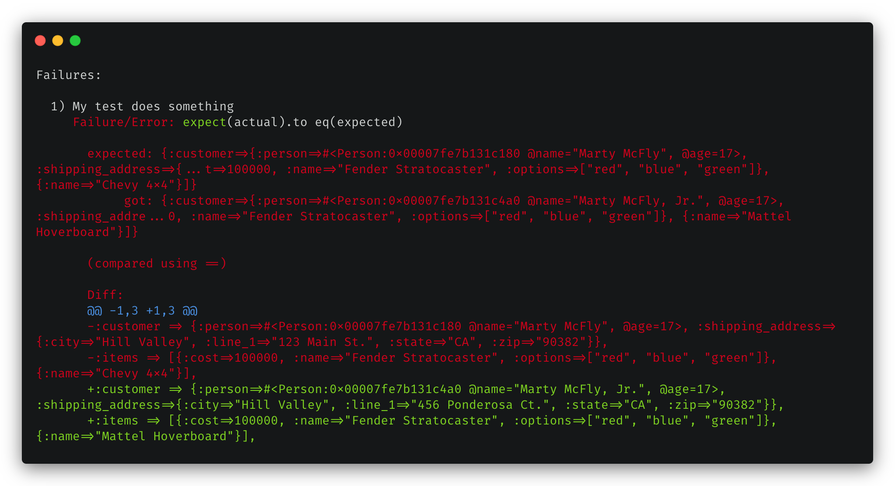
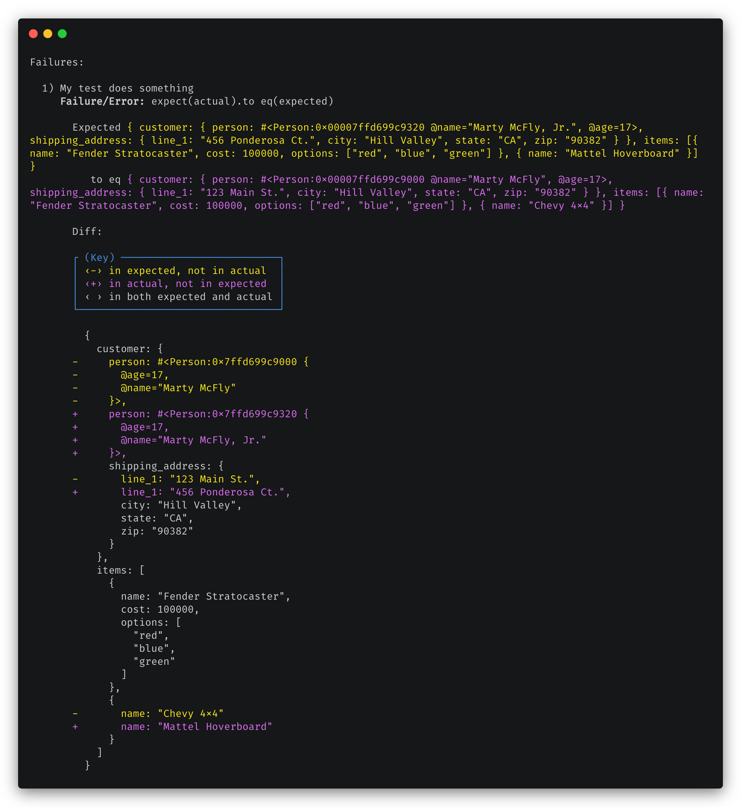

# SuperDiff [![Gem Version][version-badge]][rubygems] [![Build Status][travis-badge]][travis] ![Downloads][downloads-badge] [![Hound][hound-badge]][hound]

[version-badge]: http://img.shields.io/gem/v/super_diff.svg
[rubygems]: http://rubygems.org/gems/super_diff
[travis-badge]: http://img.shields.io/travis/mcmire/super_diff/master.svg
[downloads-badge]: http://img.shields.io/gem/dtv/super_diff.svg
[hound-badge]: https://img.shields.io/badge/Reviewed_by-Hound-8E64B0.svg
[hound]: https://houndci.com

SuperDiff is a gem that hooks into RSpec
to intelligently display the differences between two data structures of any type.

📢 **[See what's changed in the latest version (0.4.1)][changelog].**

[changelog]: CHANGELOG.md

## Introduction

The primary motivation behind this gem
is to vastly improve upon RSpec's built-in diffing capabilities.

Sometimes, whenever you use a matcher such as `eq`, `match`, `include`, or `have_attributes`,
you will get a diff of the two data structures you are trying to match against.
This is great if all you want to do is compare multi-line strings.
But if you want to compare other, more "real world" kinds of values,
such as what you might work with when developing API endpoints
or testing methods that make database calls and return a set of model objects,
then you are out of luck.
Since [RSpec merely runs your `expected` and `actual` values through Ruby's PrettyPrinter library][rspec-differ-fail]
and then performs a diff of these strings,
the output it produces leaves much to be desired.

[rspec-differ-fail]: https://github.com/rspec/rspec-support/blob/c69a231d7369dd165ad7ce4742e1a2e21e3462b5/lib/rspec/support/differ.rb#L178

For instance,
let's say you wanted to compare these two hashes:

``` ruby
actual = {
  customer: {
    person: SuperDiff::Test::Person.new(name: "Marty McFly, Jr.", age: 17),
    shipping_address: {
      line_1: "456 Ponderosa Ct.",
      city: "Hill Valley",
      state: "CA",
      zip: "90382"
    }
  },
  items: [
    {
      name: "Fender Stratocaster",
      cost: 100_000,
      options: ["red", "blue", "green"]
    },
    { name: "Mattel Hoverboard" }
  ]
}

expected = {
  customer: {
    person: SuperDiff::Test::Person.new(name: "Marty McFly", age: 17),
    shipping_address: {
      line_1: "123 Main St.",
      city: "Hill Valley",
      state: "CA",
      zip: "90382"
    }
  },
  items: [
    {
      name: "Fender Stratocaster",
      cost: 100_000,
      options: ["red", "blue", "green"]
    },
    { name: "Chevy 4x4" }
  ]
}
```

If, somewhere in a test, you were to say:

``` ruby
expect(actual).to eq(expected)
```

You would get output that looks like this:



What this library does
is to provide a diff engine
that knows how to figure out the differences between any two data structures
and display them in a sensible way.
So, using the example above,
you'd get this instead:



## Installation

There are a few different ways to install `super_diff`
depending on your type of project.

### Rails apps

If you're developing a Rails app,
add the following to your Gemfile:

``` ruby
group :test do
  gem "super_diff"
end
```

After running `bundle install`,
add the following to your `rails_helper`:

``` ruby
require "super_diff/rspec-rails"
```

### Projects using some part of Rails (e.g. ActiveModel)

If you're developing an app using Hanami or Sinatra,
or merely using a part of Rails such as ActiveModel,
add the following to your Gemfile where appropriate:

``` ruby
gem "super_diff"
```

After running `bundle install`,
add the following to your `spec_helper`:

``` ruby
require "super_diff/rspec"
require "super_diff/active_support"
```

### Gems

If you're developing a gem,
add the following to your gemspec:

``` ruby
spec.add_development_dependency "super_diff"
```

Now add the following to your `spec_helper`:

``` ruby
require "super_diff/rspec"
```

## Configuration

As capable as this library is,
it doesn't know how to deal with every kind of object out there.
If you have a custom class,
and instances of your class aren't appearing in diffs like you like,
you might find it necessary to instruct the gem on how to handle them.
In that case
you would add something like this to your test helper file
(`rails_helper` or `spec_helper`):

``` ruby
SuperDiff::RSpec.configure do |config|
  config.add_extra_differ_class(YourDiffer)
  config.add_extra_operational_sequencer_class(YourOperationalSequencer)
  config.add_extra_diff_formatter_class(YourDiffFormatter)
end
```

*(More info here in the future on adding a custom differ, operational sequencer, and diff formatter.
Also explanations on what these are.)*

## Support

My goal for this library is to improve your development experience.
If this is not the case,
and you encounter a bug or have a suggestion,
feel free to [create an issue][issues-list].
I'll try to respond to it as soon as I can!

[issues-list]: https://github.com/mcmire/super_diff/issues

## Contributing

Any contributions to improve this library are welcome!
Please see the [contributing](./CONTRIBUTING.md) document for more on how to do that.

## Compatibility

`super_diff` is [tested][travis] to work with
Ruby >= 2.4.x,
RSpec 3.x,
and Rails >= 5.x.

[travis]: http://travis-ci.org/mcmire/super_diff

## Inspiration/Thanks

In developing this gem
I made use of or was heavily inspired by these libraries:

* [Diff::LCS][diff-lcs],
  the library I started with in the [original version of this gem][original-version]
  (made in 2011!)
* The pretty-printing algorithms and API within [PrettyPrinter][pretty-printer] and [AwesomePrint][awesome-print],
  from which I borrowed ideas to develop the [inspectors][inspection-tree].

Thank you to the authors of these libraries!

[original-version]: https://github.com/mcmire/super_diff/tree/old-master
[diff-lcs]: https://github.com/halostatue/diff-lcs
[pretty-printer]: https://github.com/ruby/ruby/tree/master/lib/prettyprint.rb
[awesome-print]: https://github.com/awesome-print/awesome_print
[inspection-tree]: https://github.com/mcmire/super_diff/blob/master/lib/super_diff/object_inspection/inspection_tree.rb

## Author/License

`super_diff` was created and is maintained by Elliot Winkler.
It is released under the [MIT license](LICENSE).
